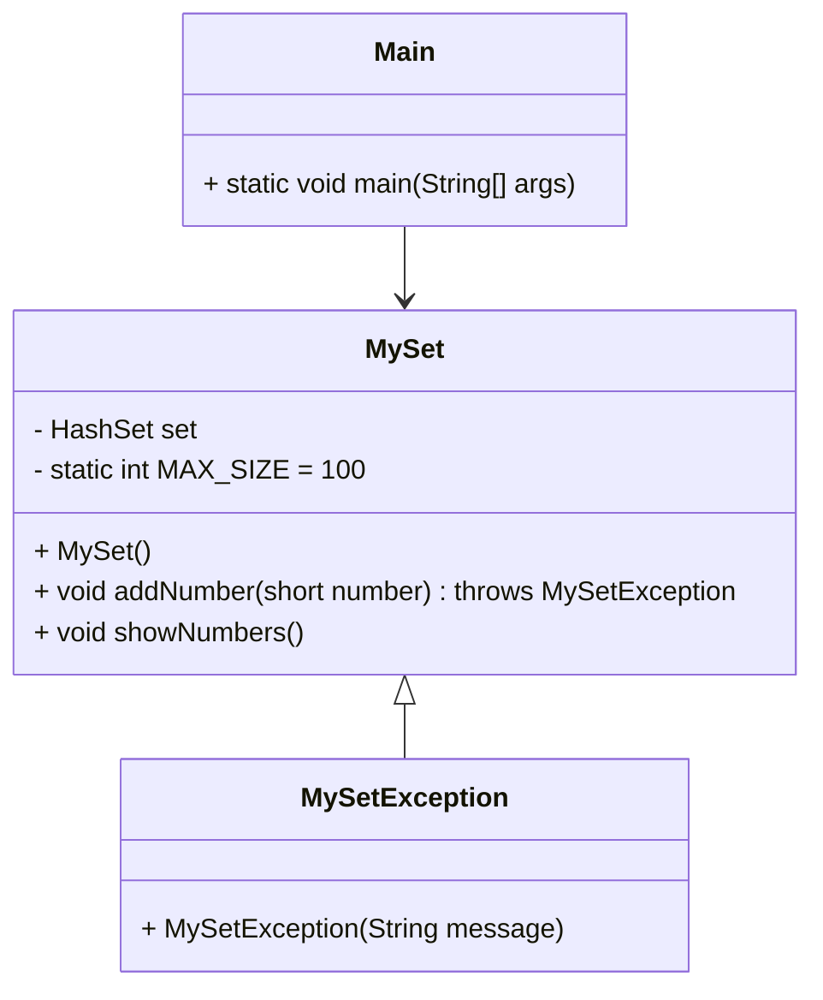

# Desafio: Implementação de Conjunto não Classificado com Tratamento de Exceções

## Descrição do Desafio

Este desafio consiste em implementar um programa em Java que gerencie um conjunto de inteiros (short int) fornecidos pelo usuário, garantindo que não haja valores duplicados. Além disso, o programa deve lançar exceções personalizadas em casos específicos e continuar a inserção de elementos mesmo após uma exceção.

## Requisitos

1. Criar uma classe chamada `MySet` que armazene os inteiros em um conjunto.
2. Implementar métodos para adicionar novos inteiros ao conjunto e exibir os números armazenados.
3. Lançar exceções personalizadas em situações específicas:
   - Se o valor já existir no conjunto.
   - Se o conjunto já tiver 100 elementos.
   - Se o valor for negativo.
4. Na classe `Main`, instanciar `MySet` e gerenciar as exceções para que a inserção de elementos continue mesmo após uma exceção.

## Estrutura do Projeto

### Classes

- **MySet**: Gerencia o conjunto de inteiros.
- **MySetException**: Exceção personalizada para erros específicos do conjunto.
- **Main**: Classe principal que gerencia a entrada do usuário e manipula exceções.

### Diagrama de Classes



## Instruções

### Pré-requisitos

- Java JDK instalado.
- Um IDE ou editor de texto para escrever código Java (como IntelliJ IDEA, Eclipse, VS Code, etc).

### Passos para Execução

1. Clone este repositório ou copie os arquivos de código fornecidos.
2. Compile as classes Java:
    ```bash
    javac MySet.java MySetException.java Main.java
    ```
3. Execute a classe `Main`:
    ```bash
    java Main
    ```

### Uso

1. Insira números inteiros positivos conforme solicitado pelo programa.
2. Para encerrar a inserção, insira um número negativo.
3. O programa exibirá mensagens de erro apropriadas se um valor duplicado ou se a capacidade máxima for atingida.

### Exemplo de Uso

```
Insira um número (negativo para sair): 10
Número adicionado: 10
Conjunto: [10]

Insira um número (negativo para sair): 20
Número adicionado: 20
Conjunto: [10, 20]

Insira um número (negativo para sair): 10
Erro: Este valor já existe.
Conjunto: [10, 20]

Insira um número (negativo para sair): -1
Programa encerrado.
```
## Licença

Este projeto está licenciado sob os termos da licença MIT. Veja o arquivo [LICENSE](LICENSE) para mais detalhes.
